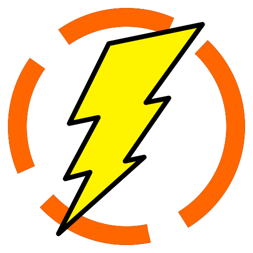

# nio

Yet another stream based C++ networking library. For now it only supports \*nix systems, Windows support is planned.

## Features

-   IPv4
-   IPv6
-   Unix sockets

## Code

To get started simply add the `include/` directory of the repo to your include paths and you can access everything in a structured format. Code namespaces correspond to directories and classes to files.

For code examples see `tests/`.
